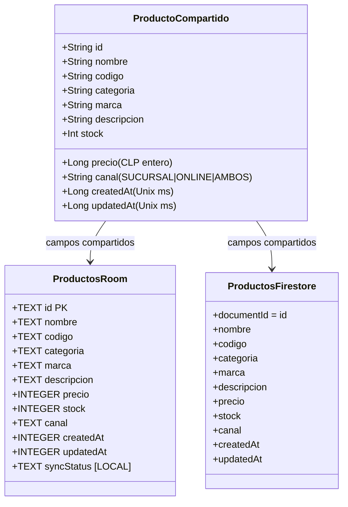

# Modelo de datos: Producto

## Propósito

Este documento define el contrato de datos de `Producto` para Stock Electrónico y la sincronización implementada en la etapa 9. La UI lee desde Room, que conserva la fuente de verdad local; Firestore es el backend de sincronización.

## Modelo y diccionario de datos

Los campos siguientes pertenecen al producto. Todos, excepto `syncStatus`, se comparten conceptualmente entre el dominio, Room y Firestore.

| Campo | Tipo Kotlin conceptual | SQLite futuro | Firestore futuro | Reglas y semántica |
| --- | --- | --- | --- | --- |
| `id` | `String` | `TEXT PRIMARY KEY` | ID del documento | UUID generado por la aplicación, obligatorio, único e inmutable. `productos/{id}` debe tener el mismo valor. No se duplica como campo. |
| `nombre` | `String` | `TEXT` | `String` | Obligatorio y no vacío. |
| `codigo` | `String` | `TEXT` | `String` | SKU o código del producto; obligatorio y no vacío. La unicidad no se valida todavía. |
| `categoria` | `String` | `TEXT` | `String` | Obligatoria y no vacía. |
| `marca` | `String` | `TEXT` | `String` | Obligatoria y no vacía. |
| `descripcion` | `String` | `TEXT` | `String` | Opcional; puede estar vacía. |
| `precio` | `Long` | `INTEGER` | número entero | Precio expresado en pesos chilenos enteros (CLP); debe ser mayor o igual a cero. Nunca se representa con `Float` ni `Double`. |
| `stock` | `Int` | `INTEGER` | número entero | Cantidad disponible; debe ser mayor o igual a cero. |
| `canal` | `String` conceptual | `TEXT` | `String` | Conjunto controlado: `SUCURSAL`, `ONLINE` o `AMBOS`. Su materialización como enum o conversor se decide con Room. |
| `createdAt` | `Long` | `INTEGER` | número temporal | Timestamp Unix en milisegundos de creación del producto. |
| `updatedAt` | `Long` | `INTEGER` | número temporal | Timestamp Unix en milisegundos de la última modificación conocida. En conflictos futuros prevalece el valor más reciente. |
| `syncStatus` | `String` conceptual | `TEXT` | No aplica | Campo exclusivo de Room/local. No se envía ni se guarda en Firestore. |

## Identificador y tiempo

La aplicación generará un UUID antes de crear un producto. Se almacenará como `String` en `id`; no se reemplaza después de creado. El identificador del documento remoto conserva exactamente ese mismo UUID, por lo que `documentId == producto.id`.

`createdAt` registra el instante de creación y no describe una actualización posterior. `updatedAt` registra la última modificación conocida. Ambos se expresan como tiempo Unix en milisegundos para conservar una comparación consistente entre almacenamiento local y remoto.

La resolución de conflictos implementada usa **gana el `updatedAt` más reciente** con las reglas de empate descritas en la sección de etapa 9.

## Representación en Room/SQLite

La tabla local se llama `productos` y tiene este esquema conceptual:

| Columna | Tipo SQLite conceptual | Observación |
| --- | --- | --- |
| `id` | `TEXT` | Clave primaria. |
| `nombre` | `TEXT` | Campo compartido. |
| `codigo` | `TEXT` | Campo compartido. |
| `categoria` | `TEXT` | Campo compartido. |
| `marca` | `TEXT` | Campo compartido. |
| `descripcion` | `TEXT` | Campo compartido. |
| `precio` | `INTEGER` | CLP entero. |
| `stock` | `INTEGER` | Cantidad entera no negativa. |
| `canal` | `TEXT` | Valor del conjunto controlado. |
| `createdAt` | `INTEGER` | Unix en milisegundos. |
| `updatedAt` | `INTEGER` | Unix en milisegundos. |
| `syncStatus` | `TEXT` | Exclusivo de la persistencia local. |

No se definen aún anotaciones de Room, restricciones SQL, índices, consultas, convertidores, migraciones ni DAO.

## Representación en Cloud Firestore

- Colección: `productos`.
- Ruta de cada documento: `productos/{id}`.
- ID de documento: el mismo UUID del producto; no se duplica como campo `id`.

Cada documento incluirá: `nombre`, `codigo`, `categoria`, `marca`, `descripcion`, `precio`, `stock`, `canal`, `createdAt` y `updatedAt`.

Firestore no incluirá `syncStatus`. La capa remota podrá decidir su tipo técnico exacto para los timestamps al implementarse, pero debe preservar su semántica y la capacidad de comparar `updatedAt`.

## Campos exclusivos locales y sincronización

`syncStatus` existe solamente en Room. Sus valores conceptuales son:

| Valor | Significado |
| --- | --- |
| `SYNCED` | El estado local conocido está sincronizado con Firestore. |
| `PENDING` | Hay una creación o actualización local pendiente de subir. |
| `PENDING_DELETE` | El producto deja de mostrarse normalmente, pero la eliminación remota está pendiente. |

`PENDING_DELETE` es un borrado lógico local durante la sincronización, sin exponer `syncStatus` como un campo remoto.

## Subida Room → Firestore

Room continúa siendo la fuente de verdad. La subida procesa primero los registros `PENDING`: realiza un upsert canónico en `productos/{id}` y, sólo tras el éxito remoto, cambia a `SYNCED`. Los `PENDING_DELETE` realizan un `delete` remoto idempotente y, sólo tras éxito, se eliminan físicamente de Room. Ante cualquier fallo remoto, el estado pendiente se conserva.

Ambas transiciones locales comprueban `id`, estado y `updatedAt` de la versión subida. Si el usuario modificó el producto durante la operación, la actualización condicional afecta cero filas y la versión nueva queda pendiente para una pasada posterior.

## Sincronización bidireccional y tiempo real (etapa 9)

Room sigue siendo la única fuente de verdad para la UI. El proceso mantiene una única suscripción de aplicación a `productos`: Firestore traduce `ADDED` y `MODIFIED` a upserts, y `REMOVED` a una eliminación remota; el coordinador serializa estos eventos y los fusiona en una transacción Room. Ninguna pantalla ni ViewModel consulta Firestore para listar o detallar productos.

La fusión usa **latest `updatedAt` wins**. Un remoto nuevo reemplaza una fila `SYNCED` o `PENDING`; uno viejo conserva la fila local. En empate el remoto es canónico y queda `SYNCED`, excepto `PENDING_DELETE`: si el remoto tiene tiempo menor o igual, se conserva el tombstone local para evitar resucitar una eliminación. Un `REMOVED` borra físicamente sólo una fila `SYNCED` o `PENDING_DELETE`; conserva `PENDING` y no hace nada si no existe.

Las descargas siempre se guardan como `SYNCED`, por lo que no producen un ciclo de subida. Errores de listener o documentos inválidos se exponen como estado controlado y nunca limpian Room. Al reconectar, el listener vuelve a entregar cambios y la cola local conserva sus pendientes.

La subida y el borrado de la cola son transacciones Firestore conscientes de conflicto. Antes de escribir o borrar leen el documento remoto: si éste tiene un `updatedAt` mayor devuelven `RemoteNewer` y no lo pisan/borran; la versión remota se fusiona en Room. Para `SYNCED` y `PENDING`, un `updatedAt` igual devuelve `RemoteCanonical`: Room debe fusionar el payload remoto, incluso si parece igual, y jamás marca el payload local como `SYNCED` sin esa reconciliación. Para `PENDING_DELETE`, un empate conserva el tombstone local y no aplica la regla de remoto canónico. Esto permite que las carreras upload/listener y delete/listener converjan sin crear `PENDING` nuevos.

## Diagrama

El diagrama separa los campos compartidos de la metadata exclusiva de Room. Si Mermaid no se renderiza, la tabla anterior es la especificación equivalente.

## Alcance de esta etapa

La etapa 9 implementa Room → Firestore, Firestore → Room, sincronización en tiempo real, resolución de conflictos y la continuidad de la cola local ante offline/reconexión. No declara completas las etapas 10 u 11.
